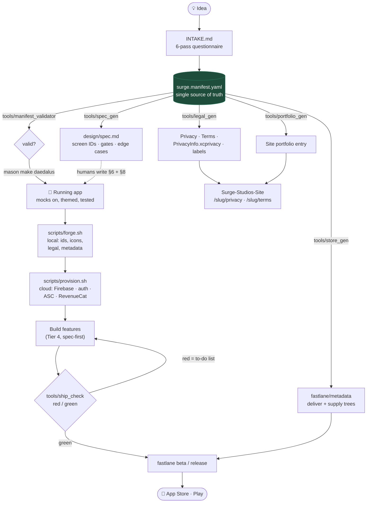

# Daedalus Wiki

The Surge Studios app factory, documented. One `surge.manifest.yaml` drives an
app, its backend, its legal, its store listing, and its web presence — this
wiki explains how every piece works and how they connect.

> **📖 Read this as a website** (sidebar, search, dark mode, rendered
> diagrams): `cd docs && npm install && npm run dev` → http://localhost:5173.
> The markdown stays the source of truth; VitePress just renders it. Deploy
> to GitHub Pages any time via the manual **Deploy docs** workflow.

**Status:** build phases 0–3 complete and verified (60 tests across 11
suites + 4 emulator-verified rules tests in the app template). Remaining work
is stubbed throughout with `🔲 TODO (Phase N)` markers and collected in
[Future systems](future.md).

## The whole factory in one picture

## Pages

| Page | What it covers |
|---|---|
| [Pipeline](pipeline.md) | The idea → shipped-app lifecycle, stage by stage, with the 1-week model |
| [Architecture](architecture.md) | The four tiers, the seam pattern (the spine), the package graph |
| [Manifest](manifest.md) | The single source of truth and everything derived from it |
| [Foundation](foundation.md) | The blank canvas: modules, routing state machine, what ships working |
| [Brick](brick.md) | Stamping mechanics, the foundation↔brick sync contract, dependency modes |
| [surge_ui](surge-ui.md) | The toolbox: token contract, catalog system, promotion path |
| [Backend](backend.md) | The safety rail: Firestore rules model, Functions, rules tests |
| [Provisioning](provisioning.md) | The cloud side automated: Firebase/GCP, auth providers, ASC, RevenueCat — from manifest + credentials |
| [Analytics](analytics.md) | The monitoring platform: per-app PostHog, the identity law, and the Surge HQ spend-vs-revenue rollup |
| [Compliance & Web](compliance-and-web.md) | Legal generation, the LLC umbrella model, site registration |
| [Release](release.md) | Store metadata, Fastlane lanes, the ship_check gate |
| [Future systems](future.md) | Phase 4/5 stubs, the debt register, the parking lot |
| [Spec-kit lessons](spec-kit-lessons.md) | Rationale record for the seven mechanisms imported from github/spec-kit (implemented 2026-07-20) |

## Ground rules that hold everywhere

- **The manifest is the only thing a human edits** for config. Generated
  wiring (nav_config, feature_registry, legal, store metadata) is
  regenerated, never hand-patched.
- **Everything real is verified**: analyze clean + tests green is the bar;
  the brick is additionally proven by stamping a real app in CI-style runs.
- **Mocks first**: every stamped app runs out of the box on in-memory
  services. Real backends are one-flag flips (see
  [Architecture § The seam pattern](architecture.md#the-seam-pattern)).
- **Generated legal is a draft** for lawyer review, not legal advice; secrets
  never enter the repo (`${VAR}` references and `--dart-define` only).

## Repo map

```mermaid
flowchart LR
    subgraph Daedalus["Daedalus (this repo)"]
        direction TB
        docsN["docs/ — this wiki"]
        intakeN["INTAKE.md · templates/"]
        schemaN["surge.manifest.schema.md<br/>+ example (fictional 'Tally')"]
        foundationN["foundation/ — Tier 1 canvas"]
        packagesN["packages/ — surge_ui,<br/>onboarding, crud, rating"]
        brickN["bricks/daedalus — the stamp"]
        toolsN["tools/ — validator, spec_gen,<br/>legal_gen, store_gen,<br/>ship_check, portfolio_gen"]
        scriptsN["scripts/ — forge.sh,<br/>check_brick_sync.dart"]
    end
    Daedalus -->|"stamps"| appRepo["your-app/ (sibling dir)"]
    Daedalus -->|"legal.json + portfolio"| siteRepo["Surge-Studios-Site"]
    ladle["Ladle (reference product)"] -.->|"patterns mined"| Daedalus
```

*Repo: `https://github.com/Surge-Studios-Dev/Daedalus` · Companion docs:
[FRAMEWORK.md](../FRAMEWORK.md) (architecture decisions),
[ROADMAP.md](../ROADMAP.md) (phase history + debts),
[DAEDALUS.md](../DAEDALUS.md) (the app contract).*
