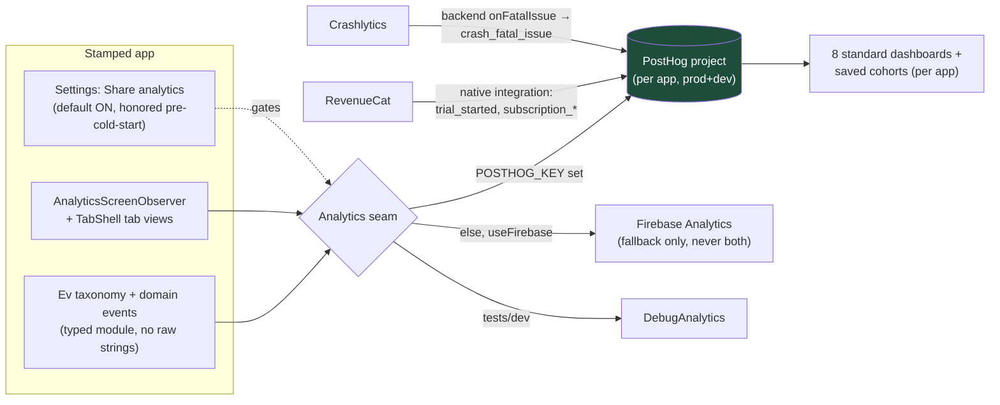
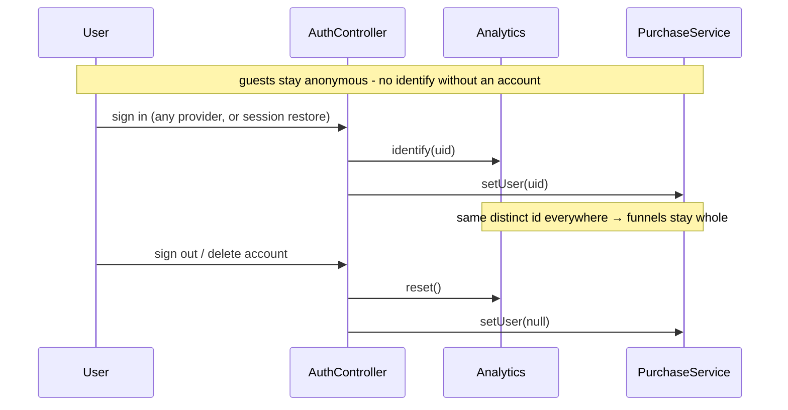
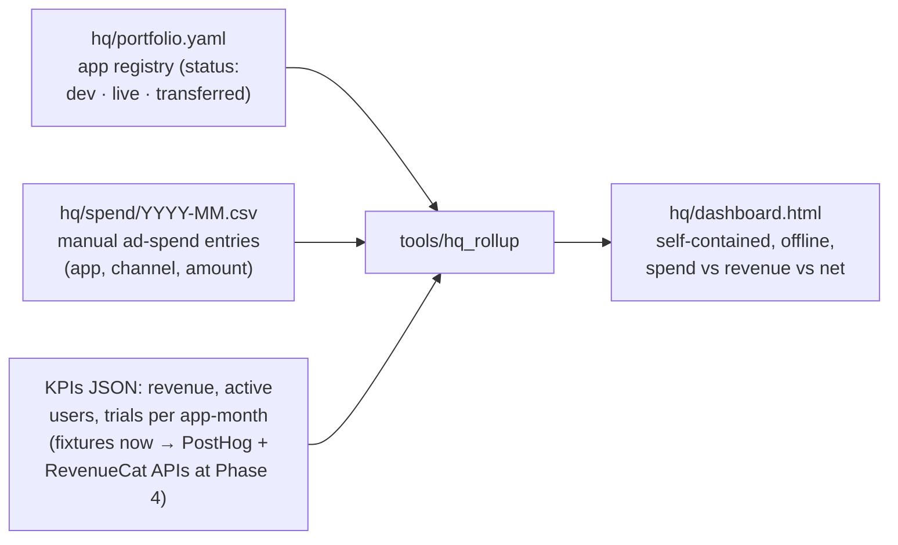

# Analytics: the monitoring platform

*Part of the [Daedalus wiki](README.md) · related: [Architecture](architecture.md),
[Provisioning](provisioning.md), [Future § Phase 5](future.md#phase-5--operate-layer) ·
doctrine source: Ladle's ANALYTICS.md*

**PostHog is the only dashboard.** Every stamped app gets detailed product
analytics as a *property of the factory*: one PostHog project per app (prod +
dev pair), RevenueCat and Crashlytics piped in, the identity law wired in
code, and a strict no-PII posture. Per-app projects are deliberate — a client
app built for a customer hands off cleanly: its PostHog project transfers
with the repo.

## How events flow

## The identity law (wired, tested, not optional)

Subscription events must share the user's distinct id or every monetization
funnel fractures. The auth controller is the single place identity binds:

A foundation widget test pins this: swapping in a signed-in auth backend must
produce an `identify` call on a recording sink.

## What every stamp carries

| Piece | What it does |
|---|---|
| `Analytics.identify/reset` + `PurchaseService.setUser` | The identity law at the seam level — every impl must handle it |
| `PosthogAnalyticsService` | Bound when `--dart-define=POSTHOG_KEY` is set; recordings off, consent-gated |
| `AnalyticsScreenObserver` + named routes + TabShell logging | Screen views with zero per-screen wiring |
| Settings "Share analytics" toggle | The opt-out the privacy policy promises; applies live and pre-cold-start |
| `ANALYTICS.md` (stamped) | The per-app doctrine: taxonomy, no-PII rules, dashboards + cohorts checklist |
| `backend/onFatalIssue` | Crashlytics fatal issues → `crash_fatal_issue` in PostHog |
| provision.sh §5b | Creates the prod+dev project pair via the PostHog API |
| ship_check | Fails on hardcoded `phc_` keys; warns if ANALYTICS.md is missing |

## Surge HQ: the portfolio rollup

The cross-app view lives at studio level (`hq/` + `tools/hq_rollup`), never
inside apps. It answers the portfolio question directly: **total ad spend vs
total revenue vs net, per month**, with per-app breakdowns.

Ad spend is manual CSV entry first (one row per app per channel per month) —
ad-network APIs are parked until paid UA actually starts. A transferred
client app keeps its registry row with `status: transferred` and simply drops
out of KPI pulls; its analytics left with the repo.

## The rules that keep the data trustworthy

- **The `Ev` base taxonomy is append-only** and identical in every app — the
  reason one dashboard template fits all of them.
- **No PII, ever**: no user text, titles, URLs, emails in names or props;
  typed event modules are the primary defense, ship_check's key scan and
  review are backstops. Recordings stay off.
- **Dev traffic never pollutes prod**: debug builds point at the dev project
  key.
- **RevenueCat owns canonical money numbers**; PostHog mirrors them for
  behavior joins; HQ reads both.

> **🔲 TODO (Phase 4):** first live run — PostHog org + keys, RevenueCat →
> PostHog integration flipped on, dashboards built from the stamped
> checklist, and the HQ KPI pull switched from fixtures to the live APIs.

> **🔲 TODO (parked):** ad-network spend APIs (Apple Search Ads / Meta /
> Google) replacing the manual CSVs, and alerting thresholds (crash-free
> floor, conversion drop) on the HQ rollup. See
> [Future systems](future.md#parking-lot).
