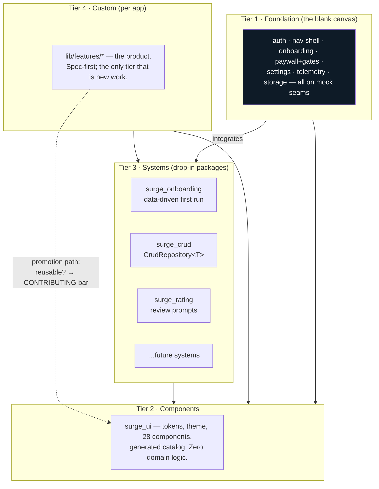
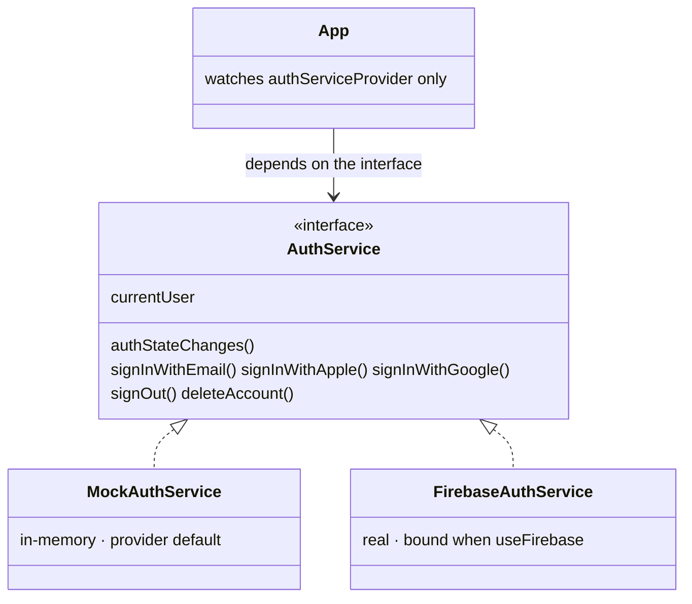
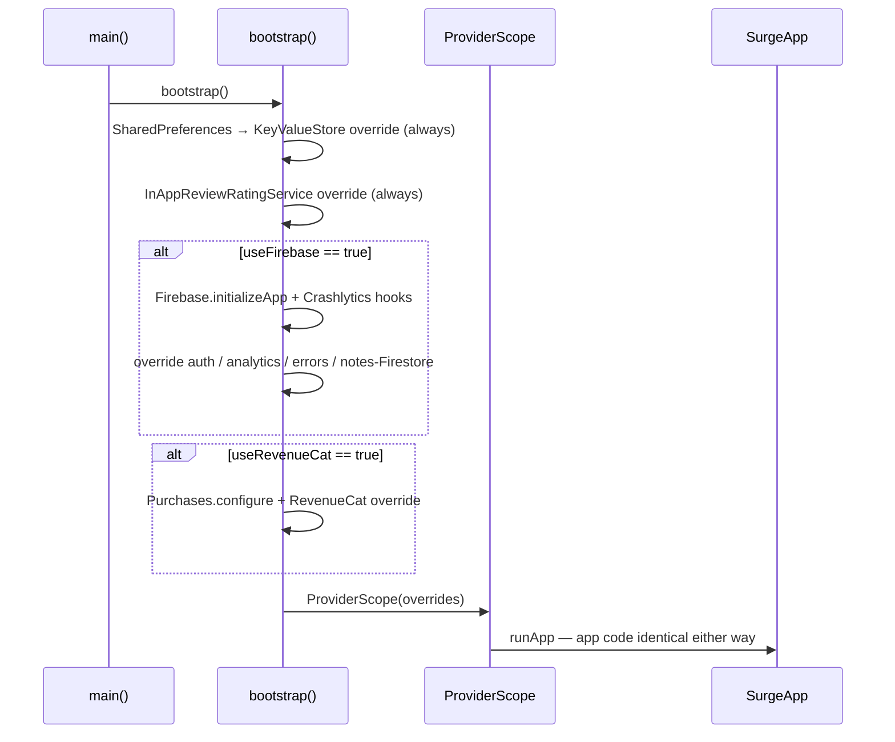
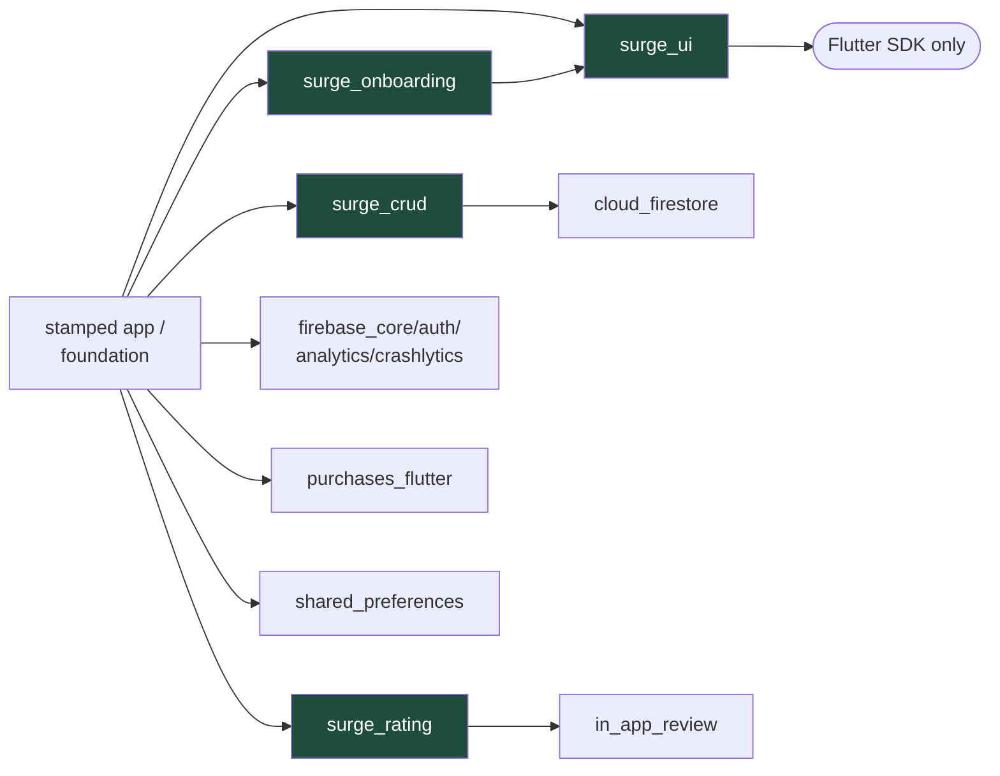

# Architecture: tiers and seams

*Part of the [Daedalus wiki](README.md) · related:
[Foundation](foundation.md), [surge_ui](surge-ui.md), [Brick](brick.md) ·
decision record: [FRAMEWORK.md](../FRAMEWORK.md)*

Two ideas carry the whole framework: a **four-tier fill model** (what gets
built at which layer) and the **seam pattern** (how the app stays
backend-agnostic). Everything else is plumbing around them.

## The four tiers

**Fill order for a new app:** the foundation arrives stamped (free), systems
drop in (cheap), custom features fill the gaps (the week), and anything
reusable gets promoted back into `surge_ui` or a new System so the next app
starts richer. The promotion bar lives in
[surge_ui/CONTRIBUTING.md](../packages/surge_ui/CONTRIBUTING.md).

## The seam pattern

The framework's spine. Every external dependency sits behind an interface
with a working mock as the Riverpod default; bootstrap swaps in the real
implementation behind one flag. Nothing downstream ever knows which is bound.

### The seven seams

| Seam | Interface | Mock default | Real binding | Flip |
|---|---|---|---|---|
| Auth | `AuthService` | `MockAuthService` | `FirebaseAuthService` (email/Apple/Google) | `useFirebase` |
| Purchases | `PurchaseService` | in-memory unlock | `RevenueCatPurchaseService` | `useRevenueCat` |
| Storage | `KeyValueStore` | `InMemoryKeyValueStore` | `SharedPrefsKeyValueStore` | always on |
| Analytics | `Analytics` | `DebugAnalytics` (prints) | `FirebaseAnalyticsService` | `useFirebase` |
| Crash reporting | `ErrorReporter` | no-op/log | `CrashlyticsErrorReporter` | `useFirebase` |
| Data | `CrudRepository<T>` | `InMemoryCrudRepository` | `FirestoreCrudRepository` at `users/{uid}/…` | `useFirebase` |
| Ratings | `RatingService` | `MockRatingService` | `InAppReviewRatingService` | always in bootstrap |

**Proof, not promise:** the foundation's backend-swap tests override *only* a
service provider and assert the whole app follows — sign-in state, account
email, gate behavior. See `foundation/test/foundation_test.dart`.

**Streams must be auth-reactive (Ember lesson, 2026-07-08).** A uid-scoped
`watchAll()` reads the uid ONCE, when the stream is created — and the app
root's keep-alive providers (widget bridge, push topics, queue drain) touch
the data chain while the sign-in screen is still up. If a `StreamProvider`
over a repo doesn't also watch the uid/auth provider, the pre-auth
`Stream.value(const [])` is cached for the app's lifetime: **writes succeed
against Firestore while the UI shows an empty list forever.** On Ember this
presented as "creating a group does nothing" — the group was in Firestore
the whole time. The foundation's notes seam already shows the canonical
shape — `repoProvider.overrideWith((ref) { final uid =
ref.watch(userUidProvider); … })` — so the binding itself rebuilds on auth.
Ember's deviation was `overrideWithValue(Repo(() => currentUid))`: a lazy
uid *getter* looks reactive but the provider graph can't see it. Bind repos
with `overrideWith` + `ref.watch` of the uid, and have every
`StreamProvider` wrapping a uid-scoped `watchAll()` also watch the uid
provider (defense in depth). It never reproduces in a dev
loop where you're already signed in before the first frame — only on a
fresh sign-in session, which is exactly what every real user's first
session is.

## Package dependency graph

Rules encoded in that graph: `surge_ui` depends on Flutter alone (tokens in,
widgets out — nothing else); Systems may depend on `surge_ui` and their one
backing plugin; the app is the only place seams get bound.

## Non-negotiable contracts

- **SurgeTokens is frozen**: bg/ink/line/accent/status/inverse/shadows. New
  fields = major version bump. Domain colors live in per-app ThemeExtensions,
  never in the shared contract. `context.tokens`, never a hex literal.
- **The `Ev` telemetry taxonomy is append-only**: `app_open, screen_view,
  sign_up, login, onboarding_complete, paywall_view, trial_start, purchase,
  restore, cancel_intent, gate_blocked, crosspromo_tap` — add domain events,
  never rename these.
- **Gating goes through `ref.gate(context, gateId, onSuccess)`** — it checks
  the entitlement and pushes `/paywall?source=gateId` when locked. No ad-hoc
  entitlement checks.

> **🔲 TODO (Phase 5):** `cross_promo` is in the taxonomy and the manifest
> (`features.cross_promo`) but the module is unbuilt — needs 2+ live apps to
> matter. See [Future systems](future.md#cross-promo-d6).
