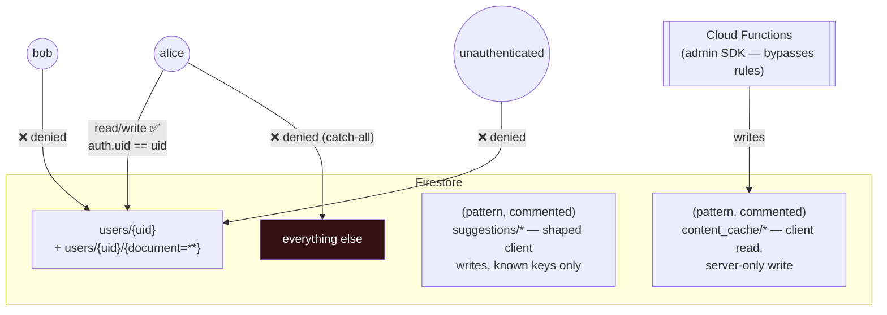
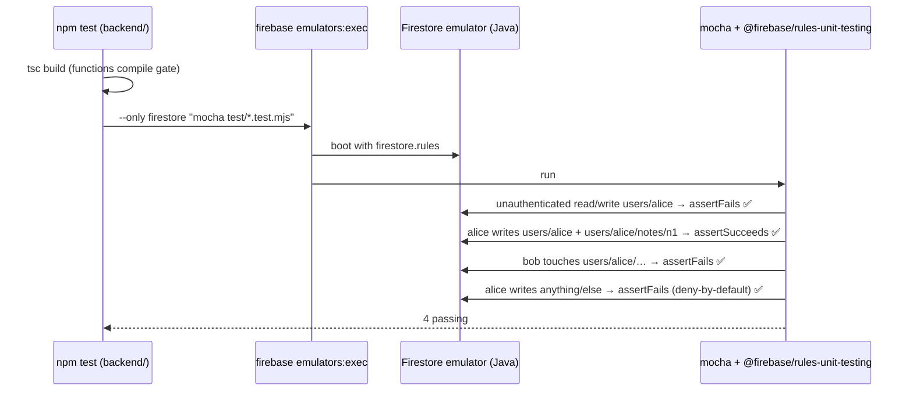
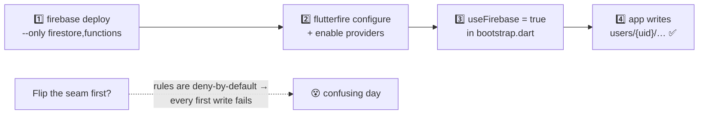

# Backend: the safety rail

*Part of the [Daedalus wiki](README.md) · related:
[Foundation](foundation.md) (notes reference), [Brick](brick.md),
[Release](release.md)*

Every stamped app ships a deny-by-default Firestore security model, a
Functions scaffold, and **unit tests that pin the security contract** — so
no Surge app can ever ship with an open database by accident.

## The rules model

Factory convention (matched by `surge_crud` usage in the app): all user data
lives under `users/{uid}/…`, and only that user can touch it. Anything not
explicitly matched is denied by the catch-all — a new collection is
unreachable *until someone writes a rule for it*, which is the point.

**The Ladle lesson, baked in:** the recursive `{document=**}` wildcard does
*not* match the bare parent doc. Both rules — on `users/{uid}` itself AND on
its subcollections — are present, so profile/seed writes to the user doc
don't fail while subcollection writes succeed (a very confusing partial
failure when it bites).

## What ships in every stamp

| File | Purpose |
|---|---|
| `firestore.rules` | The model above + commented patterns to copy |
| `firestore.indexes.json` | Empty skeleton (add as queries demand) |
| `firebase.json` | rules/indexes paths, functions source, emulator ports |
| `.firebaserc` | project id from the manifest (`integrations.firebase_project`) |
| `backend/src/index.ts` | `onAccountDeleted` — auth v1 trigger, recursively purges `users/{uid}` when an account is deleted (the privacy-policy promise; client-side auth deletion alone would strand the data). `ping` — the v2 callable pattern to copy for real endpoints. |
| `backend/test/firestore.rules.test.mjs` | 4 rules tests (below) |

## The rules test loop

Runs locally (`cd backend && npm test`; needs Java for the emulator) and in
the stamped app's CI `backend` job on every push. **Add one test per new
rule** — the suite is the executable security spec.

## Deploy order (the one that bites if you skip it)

forge.sh's checklist and [ship_check](release.md) both encode this ordering.

## Extending the backend

- **New per-user collection** → nothing to do: `users/{uid}/<anything>` is
  already covered. Follow the notes pattern
  ([Foundation](foundation.md#the-notes-reference-feature-how-tier-3-data-plumbing-looks)).
- **Shared/public data** → copy a commented pattern from `firestore.rules`,
  keep writes server-only or tightly shaped, **add a rules test**.
- **New endpoint** → copy the `ping` callable in `backend/src/index.ts`.

> **🔲 TODO (Phase 5):** Remote Config wiring (`features.remote_config`) —
> including the `trial_days` key that enforces `app_gated` trials (D5) — and
> push notifications (`features.notifications`) have no backend support yet.
> See [Future systems](future.md#phase-5--operate-layer).

> **🔲 TODO (Phase 4):** rules are emulator-verified but have never been
> deployed to a real project — first live deploy happens with live
> validation. See [Future systems](future.md#phase-4--live-validation).
