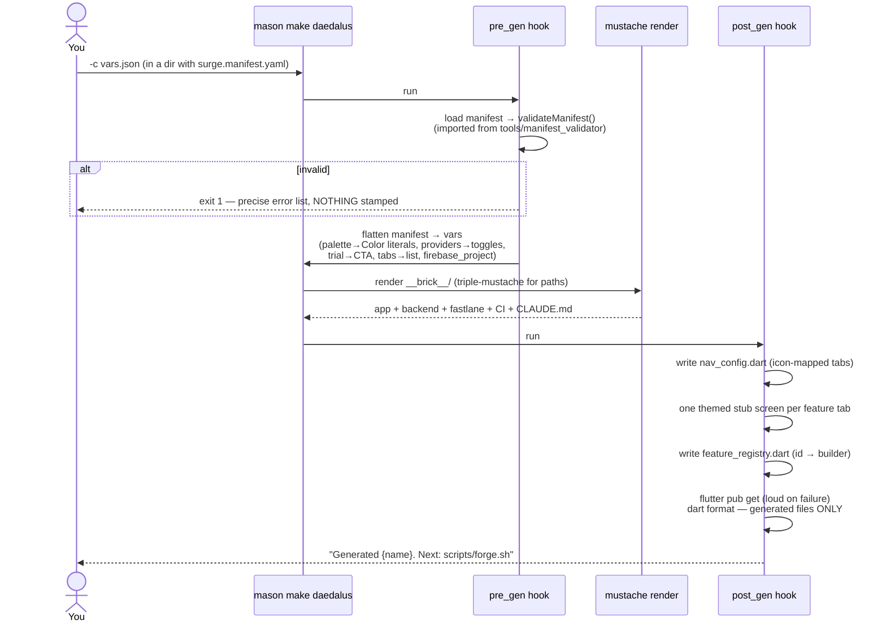
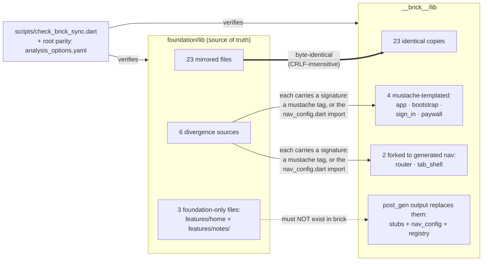
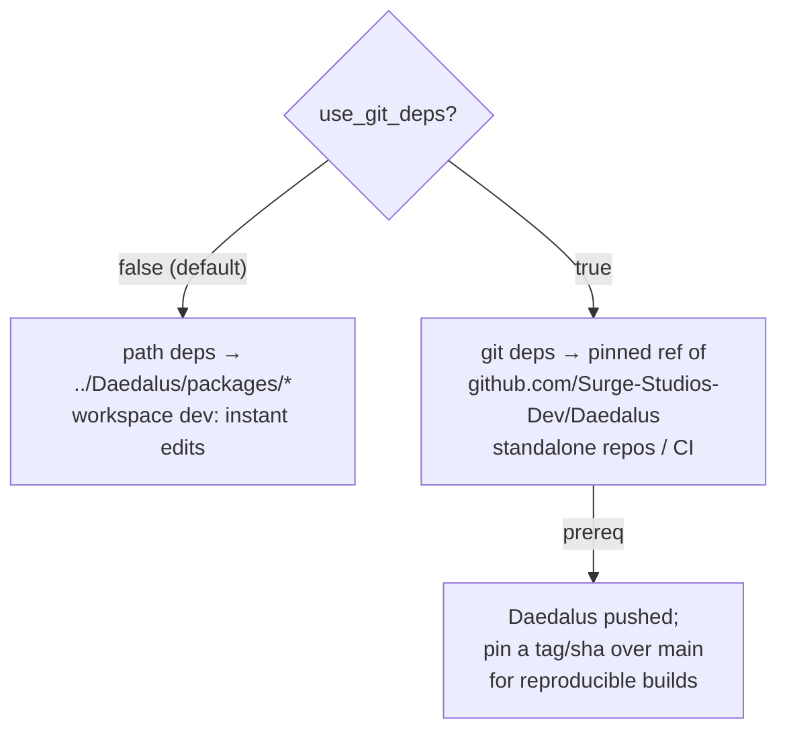

# Brick: stamping and the sync contract

*Part of the [Daedalus wiki](README.md) · related:
[Foundation](foundation.md), [Manifest](manifest.md) · brick docs:
[bricks/daedalus/README.md](../bricks/daedalus/README.md)*

`bricks/daedalus` is the Mason brick that turns a validated manifest into a
running app in ~30 seconds. Its `__brick__/` payload is a **mirror of the
foundation** plus a small, deliberately divergent set — and that contract is
machine-enforced, because it was the factory's #1 rot risk.

## The stamping sequence



Windows notes baked in from experience: `Process.run(..., runInShell: true)`
(bat resolution) and `{{{triple}}}` mustache for paths (avoids HTML-escaped
slashes).

## The sync contract (enforced in CI)

`foundation/lib` is the source of truth; `__brick__/lib` mirrors it
byte-for-byte except a named allowlist. `scripts/check_brick_sync.dart` fails
CI on any unexplained difference, clobbered template, or missing mirror.



**Workflow when you edit the foundation:** mirrored file → copy it into the
brick too; divergent file → apply the equivalent edit by hand to the brick
version; new file → mirror it or allowlist it. Then run the checker. Adding
to the divergent allowlist is an architectural decision — one more file
edited twice forever.

## Dependency modes

Stamped apps depend on the shared `surge_*` packages two ways, chosen by the
`use_git_deps` var at stamp time:



The stamped app's CI note switches with the mode; post_gen's `pub get`
failure is loud (in git mode it usually means the pinned ref doesn't contain
the packages).

## What a stamp contains beyond lib/

| Piece | Source |
|---|---|
| `analysis_options.yaml` | root-parity copy of the foundation's (same lints) |
| `backend/` + `firestore.rules` + `firebase.json` + `.firebaserc` | [Backend](backend.md) |
| `fastlane/` + `Gemfile` + `fastlane/metadata` (via store_gen) | [Release](release.md) |
| `.github/workflows/ci.yml` | flutter job + backend job (rules tests) |
| `test/smoke_test.dart` | boots the app to the sign-in screen |
| `CLAUDE.md` | per-app working rules: spec-first, IDs in commits |

## Stamping by hand (the verified recipe)

```bash
mkdir my-app && cd my-app
cp ../Daedalus/surge.manifest.example.yaml surge.manifest.yaml  # then edit
# vars.json: supply every brick var (avoids interactive prompts)
mason init
mason add daedalus --path ../Daedalus/bricks/daedalus
mason make daedalus -c vars.json
flutter analyze && flutter test   # clean + green on day 0
```

> **🔲 TODO (future):** goldens for the stamped app (D7) and a re-stamp
> "diff mode" for applying manifest changes to built apps are parked — see
> [Future systems](future.md#parking-lot).
