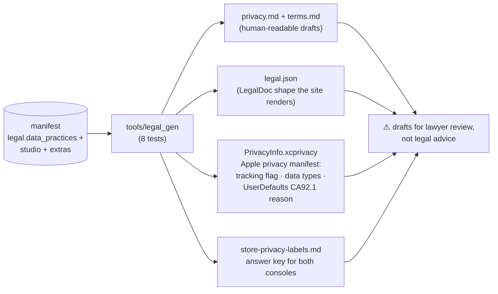
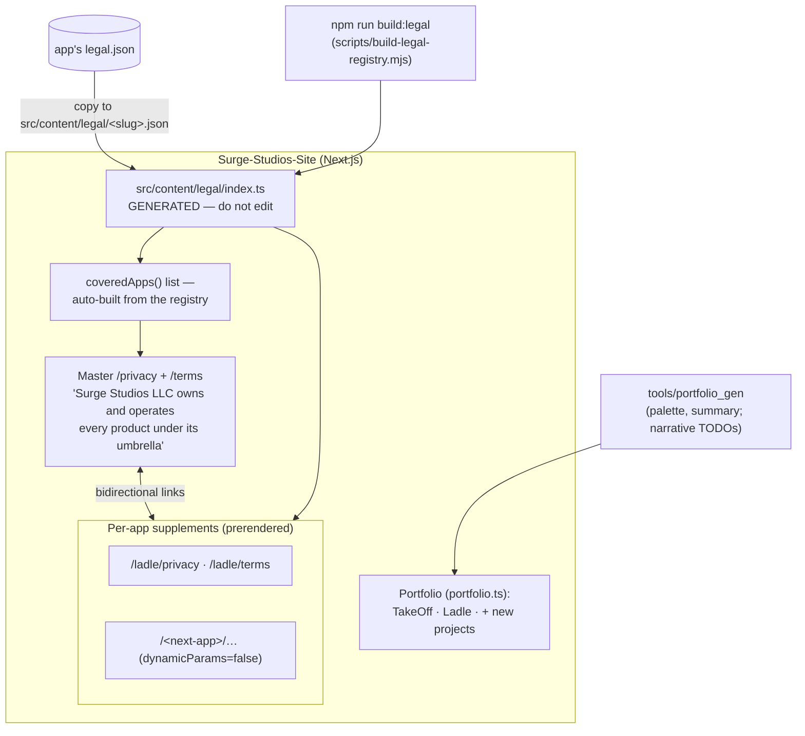

# Compliance & Web: legal generation and the umbrella

*Part of the [Daedalus wiki](README.md) · related: [Manifest](manifest.md),
[Release](release.md) · site repo: `Surge-Studios-Site`*

Surge Studios LLC owns every product under its umbrella, and the legal
architecture mirrors that: **master policies on the studio site govern all
apps; each app adds a thin product-specific supplement.** All of it is
generated from the manifest's `legal` block.

## What legal_gen produces



Flag-driven content: `collects_email` → account/data sections; `analytics` /
`crash_reporting` → the Firebase/Crashlytics provider entries; `tracking` →
ATT language (and [ship_check](release.md) enforces the Info.plist string);
`extra_providers` (e.g. Ladle's Gemini + PostHog) and `domain_disclaimer`
(e.g. food/health AI) append their sections; billing text follows the
monetization model.

## The LLC umbrella model on the site



**Master docs govern; supplements specialize.** A per-app page opens with
"owned and operated by Surge Studios LLC" and links up to the master
policies; the master lists every covered product and links down. Adding an
app updates the master's coverage list automatically via the registry.

## Registering a new app on the site (the whole ritual)

```bash
# 1. from the app repo (forge step 4 already generated legal/)
cp legal/legal.json ../Surge-Studios-Site/src/content/legal/<slug>.json

# 2. in the site repo
npm run build:legal        # regenerates the registry + coverage list
# → /<slug>/privacy and /<slug>/terms prerender; master lists the app

# 3. portfolio card
cd ../Daedalus/tools/portfolio_gen && dart run bin/portfolio_gen.dart <manifest>
# paste into src/content/portfolio.ts, then WRITE the narrative TODOs

# 4. deploy the site BEFORE store submission —
#    legal.privacy_url must resolve live for review
```

The manifest's `legal.privacy_url` / `terms_url`
(`https://surgestudios.dev/<slug>/privacy|terms`) resolve to exactly these
prerendered pages — the loop from manifest to live URL is closed.

## Apple-specific artifacts

`PrivacyInfo.xcprivacy` must live **inside the iOS Runner and be added to
the Xcode target** — forge copies it to `ios/Runner/` and
[ship_check](release.md) verifies both the file and the pbxproj reference.
The store-labels answer key exists so console questionnaires are transcription,
not archaeology.

## Standing human obligations

- Lawyer review before first submission (generated text is a scaffold).
- Confirm studio facts: LLC name, Alabama governing law, support emails.
- `support@<domain>` must exist and be monitored before submission.
- Deploy the site so legal URLs are live *before* store review.

> **🔲 TODO (future):** per-app marketing pages on the site are
> semi-automated only (portfolio card yes, dedicated landing page no) — see
> [Future systems](future.md#parking-lot).
