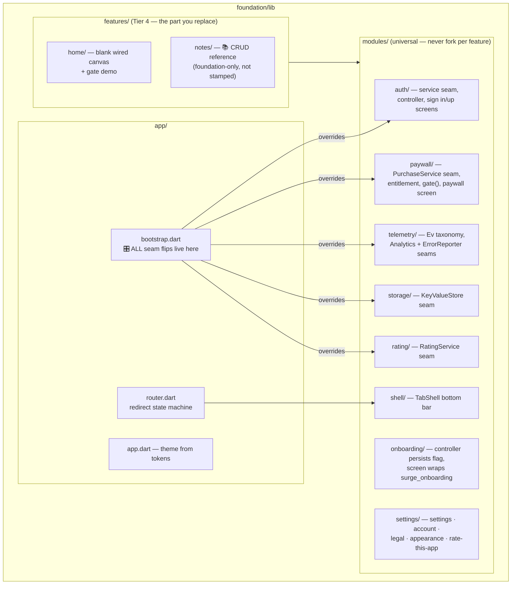
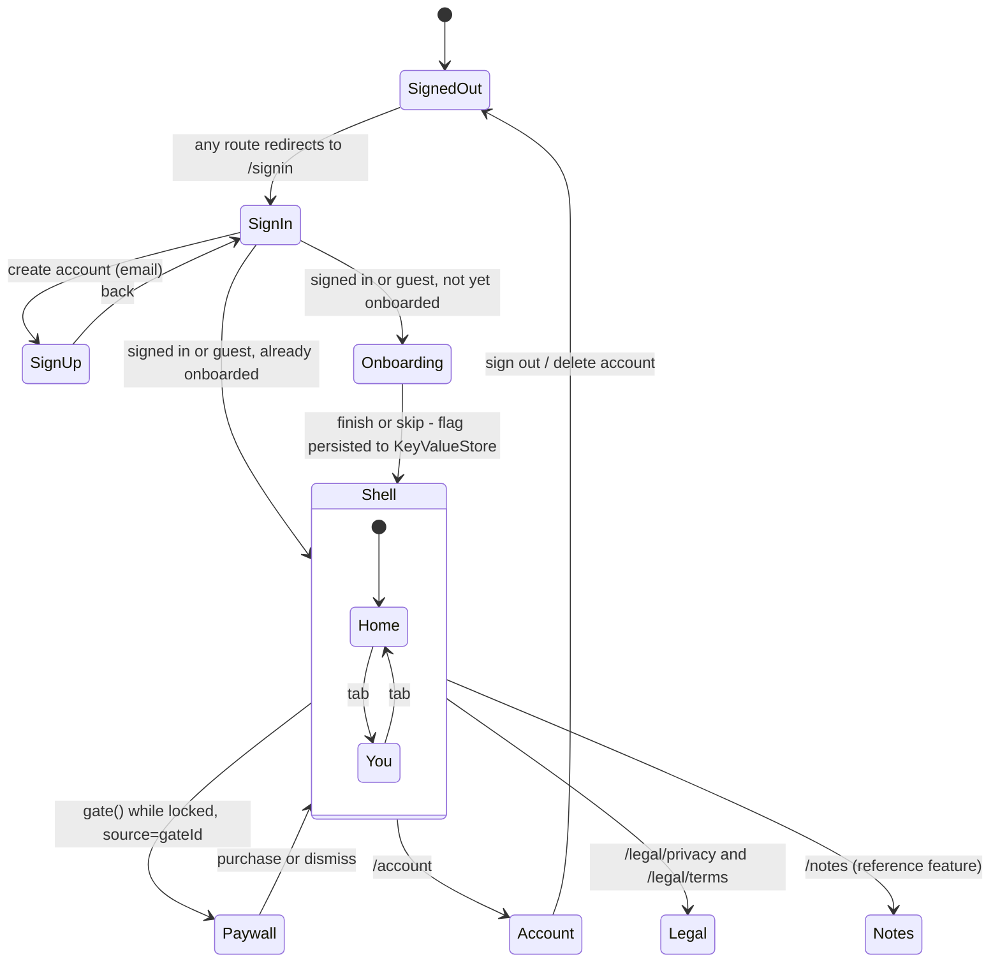
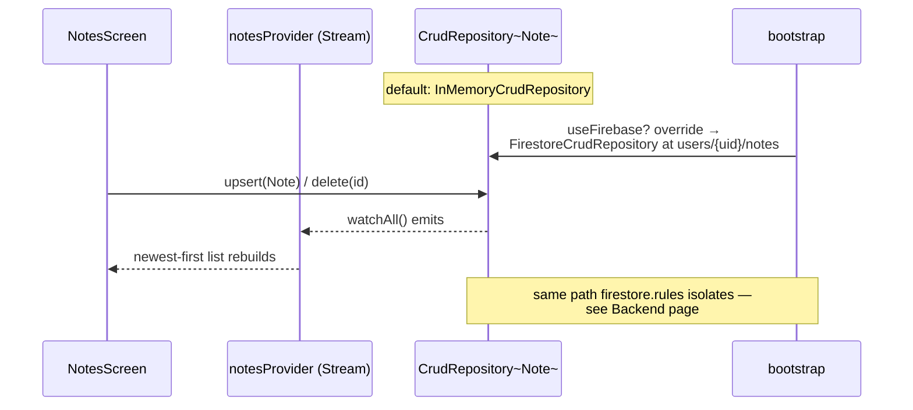

# Foundation: the blank canvas

*Part of the [Daedalus wiki](README.md) · related:
[Architecture](architecture.md), [Brick](brick.md), [surge_ui](surge-ui.md)*

`foundation/` is Tier 1: a **runnable** app with every universal concern
already working on mock seams — sign-in/up, guest mode, onboarding, tab
shell, paywall + gates, settings stack, telemetry, persistence, ratings, and
a CRUD reference feature. It is the source of truth the
[brick](brick.md) mirrors. 11 widget tests keep it honest.

## Module map



## The routing state machine

`router.dart` redirects on two watched providers — auth state and the
persisted onboarding flag. Order matters: **sign-in → onboarding → app.**



Subtleties the tests pin down:

- **Guest is an app-level state**, not an auth account. The auth controller
  never knocks a guest back to `signedOut` when the backend reports no user.
- **Onboarding is persistence-driven**: seeding the key-value store with
  `onboarding_complete: true` skips onboarding with *no* controller override
  — proving the flag, not the controller, owns the flow.
- **Backend swaps drive the app**: binding a fake signed-in `AuthService`
  boots straight to Home; binding an unlocked `PurchaseService` makes
  `gate()` run its action instead of presenting the paywall.

## What each screen ships as

| Screen | State on day 0 | Customize |
|---|---|---|
| Sign in / up | Working (mock): email fields, Apple/Google buttons per manifest, guest mode | Copy + which buttons (manifest) |
| Onboarding | surge_onboarding data-driven flow, logs `Ev.onboardingComplete` | Page content (Tier 3 config) |
| Home | Blank wired canvas + gate demo (stamped apps: one themed stub per feature tab) | Replace entirely (Tier 4) |
| Paywall | Trial-aware CTA from manifest, purchase/restore against the seam | Headlines per gate (spec §6) |
| Settings | Account, subscription, appearance cycle, rate-this-app, support, legal, version | Add app rows as deltas |
| Account | Email display, sign out, delete-account with confirm dialogs | Usually nothing |
| Legal | Renders privacy/terms | Nothing (generated content) |
| Notes (foundation only) | `NTS-01` — the CrudRepository reference: add/delete over the seam, in-memory → per-user Firestore | Read it, copy the pattern, build your own |

## The notes reference feature (how Tier-3 data plumbing looks)



Guests stay on the in-memory repository until they create an account; the
override watches `userUidProvider` so the binding follows auth state.

## Commands

```bash
cd foundation
flutter analyze      # must be clean
flutter test         # 11 tests
flutter run          # boots to sign-in on mocks
```

> **🔲 TODO (Phase 5):** `features.remote_config` and `features.notifications`
> flags exist in the manifest but nothing in the foundation consumes them
> yet; the `app_gated` trial window is likewise unenforced (D5). See
> [Future systems](future.md#phase-5--operate-layer).
