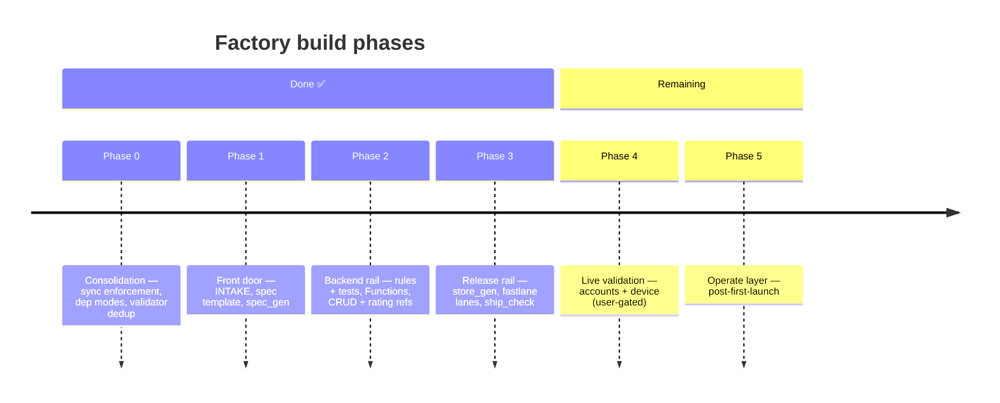
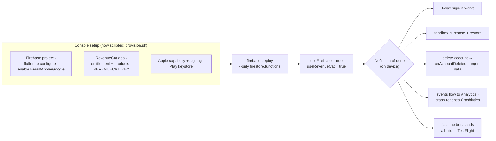

# Future systems

*Part of the [Daedalus wiki](README.md) — the collection point for every
`🔲 TODO` stub scattered through the other pages. Each entry here is a
design-ready stub: enough shape to start, deliberately unbuilt.*

## Where we are

The scaffolding era is over: **the next unit of factory work should be
pulled by a real app**, not pushed by the roadmap. Run
[INTAKE.md](../INTAKE.md) on the next idea; Phase 4 happens naturally along
the way, and Phase 5 items activate at first launch.

---

## Phase 4 · Live validation

**Status: 🔲 stub — blocked only on human accounts + a device.** All code
paths are ready; this phase flips them against reality for the first time.

Exit criteria: every box green on a physical device, and the mock→live flip
documented as an updated forge checklist with anything that surprised us.
Phase 4 is also the first live execution of
[`scripts/provision.sh`](provisioning.md) — run `--dry-run` first, expect to
pin `fastlane produce` flags and RevenueCat v2 payload shapes, then remove
its skeleton-honest caveat.

---

## Phase 5 · Operate layer

**Status: 🔲 stub — deliberately post-first-launch.** Four sub-systems:

### Remote Config + app_gated trials (D5)
Wire `features.remote_config` for real: fetch-and-activate in bootstrap,
typed accessor module, kill-switch key convention. Then enforce the
`app_gated` trial window (`trial_days` key; local-first with server
override) so `one_time` apps get their promised trial mechanics — today the
manifest accepts the model but `gate()` ignores the window.

### Analytics sink + portfolio dashboard
The `Ev` taxonomy already flows per-app. Missing: the cross-app view — one
place showing installs, trials, conversions per product under the umbrella.
Likely BigQuery export + a small dashboard page; decide when there are two
revenue streams to compare.

### Cross-promo (D6)
`features.cross_promo` + `Ev.crosspromoTap` exist; the module doesn't. Sketch:
a settings section "More from Surge Studios" fed by a remote JSON manifest of
live apps (name, icon, one-liner, store links), so every app markets the
others with zero per-app work. Needs ≥2 live apps to be worth building.

### Sunset playbook
The un-launch checklist: store delisting, subscription wind-down
communication, data-export window, Firebase project archival, site portfolio
annotation. Write it *before* it's needed; it's a template, not code.

---

## Open debts (from [ROADMAP.md](../ROADMAP.md) §3)

| # | Debt | Trigger to fix |
|---|---|---|
| D5 | app_gated trial unenforced; remote_config/notifications flags unwired | First `one_time` app, or Phase 5 |
| D6 | Cross-promo unbuilt | Second live app |
| D7 | No golden tests (gallery check is manual) | When surge_ui visual churn slows |
| D10 | Loose version pins ("newer available" warnings) | **Before the first release build** — pin then |

---

## Parking lot (ideas with no phase yet)

- **Store-side product automation** — create the actual IAP/subscription
  records in App Store Connect (ASC API) and Play (Developer API) from the
  manifest's products + reference prices, completing
  [provisioning](provisioning.md); today they're manual with generated ids.
- **`daedalus update`** — apply manifest changes to an already-built app as
  a guided diff instead of a scratch-dir re-stamp ([Manifest](manifest.md)).
- **Screenshot pipeline** — generate store screenshots from the app's
  signature moment; fastlane frameit or a gallery-driven harness
  ([Release](release.md)).
- **Per-app marketing pages** — the site auto-hosts legal + portfolio cards;
  a templated landing page per app is the missing third
  ([Compliance & Web](compliance-and-web.md)).
- **First promotion cycle** — exercise the Tier-4 → surge_ui promotion bar
  with a real component from the next app ([surge_ui](surge-ui.md)).
- **Notification templates** — spec §7 exists in the pipeline; a
  `surge_notifications` System (FCM + local scheduling + the 1/day cap from
  the Ladle rules) once an app needs it.
- **Windows/desktop targets** — everything is phone-first; revisit if a
  product wants it.
- **Docs site: VitePress 2 upgrade** — `npm audit` in `docs/` reports three
  Vite-5 advisories that are dev-server-only (path traversal / fs.deny
  bypass / launch-editor NTLM — all require a running `npm run dev` plus
  attacker interaction; the static build ships none of Vite). esbuild is
  already overridden to a patched version. Upgrade when VitePress 2 is
  stable AND vitepress-plugin-mermaid declares 2.x peer support — that
  moves the toolchain to Vite 7 and clears the audit.

## How to add a new future system to this wiki

1. Stub it here with a status line and enough shape to start.
2. Drop a `> **🔲 TODO (…):** …` marker on the page(s) it touches, linking
   back to this file.
3. When built: move the content to its real page, add tests to the
   [verified-state table](../ROADMAP.md#1-what-exists-and-is-verified), and
   delete the stub.
