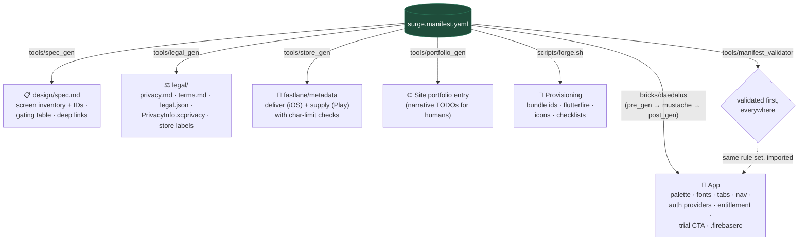
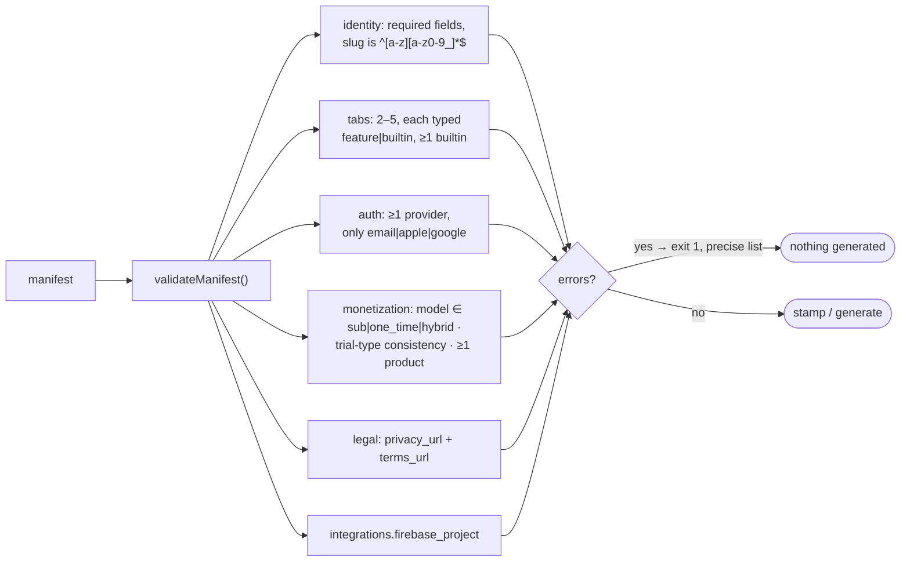

# The manifest: single source of truth

*Part of the [Daedalus wiki](README.md) · related: [Pipeline](pipeline.md),
[Brick](brick.md), [Compliance & Web](compliance-and-web.md) · schema:
[surge.manifest.schema.md](../surge.manifest.schema.md)*

`surge.manifest.yaml` is the one file a human edits to configure an app.
Everything else is **derived** — and rederivable when the manifest changes.
The worked example is [`surge.manifest.example.yaml`](../surge.manifest.example.yaml)
("Tally", a *fictional* demo app); the real shipping example is
[`examples/ladle.manifest.yaml`](../examples/ladle.manifest.yaml).

## Everything the manifest drives

**One rule set:** `tools/manifest_validator` owns the schema rules (and the
tests). The brick's pre_gen hook *imports* it — there is no duplicated
inline copy to drift.

## Section → consumer map

| Manifest section | Key fields | Consumed by |
|---|---|---|
| `identity` | slug, name, tagline, bundle ids | brick (app id, copy), spec_gen, store_gen (name/subtitle), portfolio_gen, forge (rename) |
| `studio` | name, support_email, marketing_site | legal_gen (contact), store_gen (URLs), brick (support copy) |
| `brand` | palette (accent/soft/panel), fonts, logo_mode | brick (theme), spec_gen (§2/§9), portfolio_gen (card palette) |
| `navigation` | tabs (2–5, ≥1 builtin), primary_action | brick (nav_config + stubs + registry), spec_gen (inventory + IDs) |
| `auth` | providers ⊆ {email, apple, google}, guest_mode | brick (sign-in buttons), spec_gen (AUTH screens). Apple auto-included with any social (Guideline 4.8) |
| `monetization` | model, entitlement, trial, products, gates | brick (paywall CTA, entitlement id), spec_gen (gating table), forge (RevenueCat checklist) |
| `features` | remote_config, notifications, cross_promo | brick (dep comments), spec_gen (§7) — *enforcement is Phase 5* |
| `legal` | privacy/terms URLs, data_practices, extras (governing_law, content_summary, domain_disclaimer, extra_providers) | legal_gen (everything), ship_check (ATT when tracking), store_gen (privacy URL) |
| `store` | category, age_rating, keywords, descriptions | store_gen (metadata trees), spec_gen |
| `integrations` | firebase_project, `${REVENUECAT_KEY}` ref | brick (.firebaserc), forge (flutterfire) — **never a literal secret** |

## Validation rules (fail-fast, before anything is generated)

Trial-type consistency worth remembering: `subscription` can't use
`app_gated` (the store owns subscription trials) and `one_time` can't use
`store_intro_offer` (there's no subscription to attach it to).

## Changing a manifest later

| Changed | Then run |
|---|---|
| Store copy (descriptions, keywords) | `store_gen` — regenerates metadata; never edit the txt files |
| Data practices / legal fields | `legal_gen` → recopy `legal.json` to the site → `npm run build:legal` |
| Palette / fonts | re-stamp or hand-apply to `app.dart` theme block |
| Tabs / gates | re-stamp into a scratch dir and diff — nav wiring is generated |

> **🔲 TODO (future):** no `daedalus update` command exists — applying
> manifest changes to an already-built app is a manual diff today. Parked in
> [Future systems](future.md#parking-lot).
