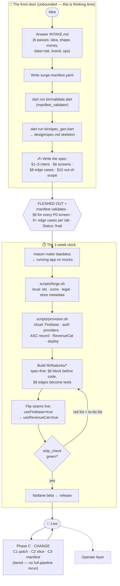
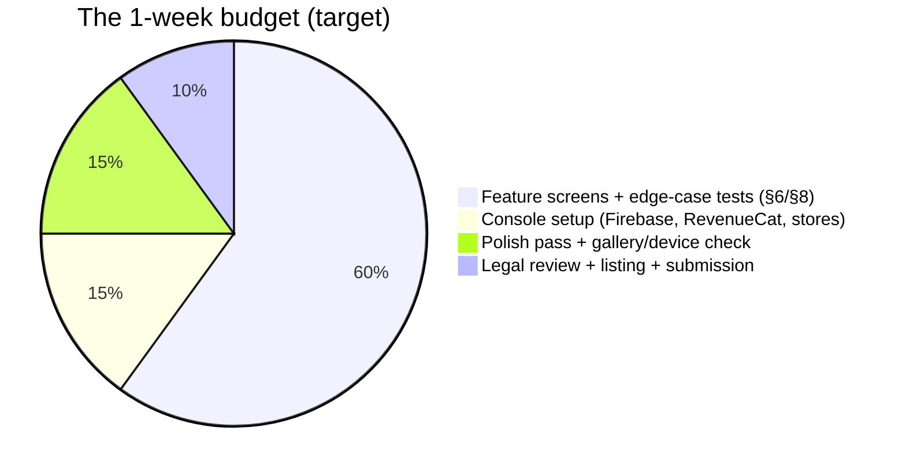

# Pipeline: idea → shipped app

*Part of the [Daedalus wiki](README.md) · related:
[Manifest](manifest.md), [Brick](brick.md), [Release](release.md)*

The goal the factory is built around: **an app released within ~1 week of the
idea being fleshed out.** "Fleshed out" has a precise definition (below), and
the clock starts there — not at the first daydream.

## The full lifecycle



> **🔲 TODO (Phase 5):** the *operate* stage (analytics sink, Remote Config,
> cross-promo, sunset playbook) is stubbed — see [Future systems](future.md).

## Stage by stage

| Stage | Command / artifact | Time | Docs |
|---|---|---|---|
| Intake | [`INTAKE.md`](../INTAKE.md) conversation → manifest | thinking time | [Manifest](manifest.md) |
| Validate | `tools/manifest_validator` — fail-fast schema rules | seconds | [Manifest](manifest.md) |
| Spec | `tools/spec_gen` → `design/spec.md`; humans write intent at `**TODO**` markers | the real work | [templates/spec.template.md](../templates/spec.template.md) |
| Stamp | `mason make daedalus -c vars.json` | ~30 s | [Brick](brick.md) |
| Forge (local) | `scripts/forge.sh` (idempotent, safe to re-run) | minutes | [Release](release.md) |
| Provision (cloud) | `scripts/provision.sh [--dry-run]` — Firebase, auth, ASC, RevenueCat from `provision.env` | minutes + small manual core | [Provisioning](provisioning.md) |
| Build | `lib/features/*` on [surge_ui](surge-ui.md), gated by `ref.gate()` | days 1–5 | [Foundation](foundation.md) |
| Go live | deploy backend → flip seams | ~1 h | [Backend](backend.md) |
| Gate | `tools/ship_check` — red/green, exit 1 on blockers | seconds | [Release](release.md) |
| Ship | `bundle exec fastlane ios beta` etc. | minutes + review time | [Release](release.md) |

## After launch: the CHANGE loop (Phase C)

The pipeline above ships v1; it does not rerun for every live change — a
4-hour bug fix doesn't need a PRD, and it doesn't get to skip the spec
either. Post-ship work is tiered by what it touches: **C1 patch** (code
only — merge bar and a `state.yaml` log line), **C2 slice** (a screen or
behavior — spec §6/§8 delta approved by the human, built with tests, board
re-captured), **C3 manifest** (a `surge.manifest.yaml` field — rerun the
owning INTAKE pass, re-validate, regen derived artifacts, then C2 for the
UI). Tiers, pushback triggers, and exit gates live in
[RUNBOOK.md](../RUNBOOK.md) Phase C.

## What the stamp hands you on day 0

A fresh stamp **runs immediately** — sign-in (mock), onboarding, tab shell
with themed stubs, paywall + gates (mock purchases), settings/account/legal,
telemetry taxonomy, rate-this-app, deny-by-default Firestore rules, Functions
scaffold, Fastlane lanes, CI. `ship_check` on day 0 shows exactly six red
items — and that red list **is** the launch to-do list:

```text
[FAIL] feature stubs      → build the real features
[FAIL] firebase seam      → flutterfire configure + flip
[FAIL] revenuecat seam    → RevenueCat setup + flip
[FAIL] firebase options   → flutterfire configure
[FAIL] privacy manifest   → forge.sh (flutter create + copy)
[FAIL] legal artifacts    → forge.sh step 4 + site registration
```

## Where the week actually goes

The factory automates everything *around* the product so the week is spent on
the product itself:



> **🔲 TODO (Phase 4):** the week has not yet been run end-to-end against a
> real device/accounts — the first live validation will calibrate this
> budget. See [Future systems](future.md#phase-4--live-validation).
