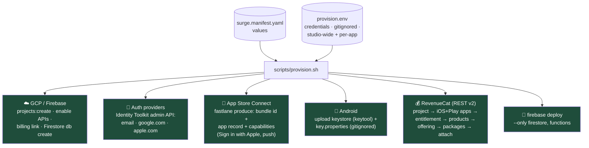
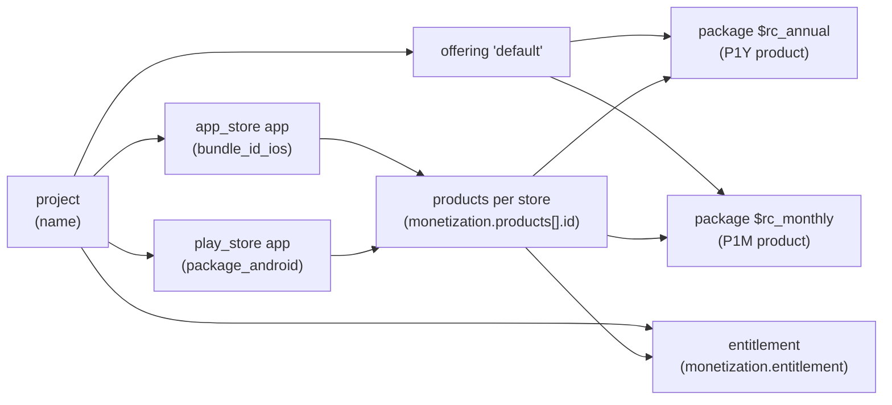
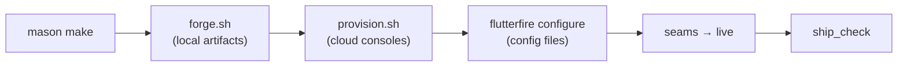

# Provisioning: the cloud side, automated

*Part of the [Daedalus wiki](README.md) · related: [Pipeline](pipeline.md),
[Backend](backend.md), [Release](release.md), [Future systems](future.md)*

`scripts/provision.sh` stands up everything the consoles used to demand by
hand — Firebase/GCP project, Firestore, auth providers, the App Store
Connect record, Android signing material, and the complete RevenueCat object
graph — reading the manifest for values and `provision.env` for credentials.

**Status: skeleton-honest.** Built against the documented CLIs and REST
APIs, dry-run verified against the example manifest; the first live run
(Phase 4) is expected to adjust flag spellings and API shapes. `--dry-run`
prints the entire plan with real values and touches nothing:

```bash
cd my-app
bash ../Daedalus/scripts/provision.sh --dry-run   # review the plan
bash ../Daedalus/scripts/provision.sh             # execute (soft-fails to notes)
```

## What it automates



Every step degrades to a `note` when its tool or credential is missing —
the script never blocks; it tells you what's left.

## The credentials contract

Copy [`provision.env.example`](../provision.env.example); loaded in order
(later wins), never committed (the script gitignores it in the app repo):

| File | Scope | Holds |
|---|---|---|
| `~/.surge/provision.env` | studio-wide, set once | `GCP_BILLING_ACCOUNT`, `ASC_KEY_PATH` (App Store Connect API key), `REVENUECAT_SECRET_KEY`, `PLAY_JSON_KEY_PATH` |
| `<app>/provision.env` | per-app overrides | `ANDROID_KEYSTORE_PASS`, optional `RC_PROJECT_ID` |

## The RevenueCat object graph (all from the manifest)



One package per price tier; the iOS and Play *products* both attach to it
(products are per-store-app in RevenueCat, packages are not).

## What stays manual — and why

| Task | Why | Softened by |
|---|---|---|
| Play Console "Create app" | Google ships no API for it | 2-minute click; everything after is `supply` |
| Apple privacy labels + Play data safety forms | console-only questionnaires | answers pre-generated in `legal/store-privacy-labels.md` |
| Store-side IAP/subscription products | ASC/Play product APIs exist but are deep + fragile — parked | ids + reference prices come from the manifest; see [parking lot](future.md#parking-lot) |
| Screenshots | needs the app looking real | parked screenshot pipeline |
| Studio enrollments (Apple $99, Play $25, GCP billing card, RevenueCat account, domain + support email) | identity/payment verification is inherently human | **one-time per studio, amortizes across every app** |

## Where it sits in the pipeline



forge = files in the repo; provision = state in the clouds. forge's manual
checklist survives as the fallback/verification list.

> **🔲 TODO (Phase 4):** first live execution — expect to pin exact
> `fastlane produce` flags and RevenueCat v2 payload shapes, then remove the
> skeleton-honest caveat. See [Future systems](future.md#phase-4--live-validation).
