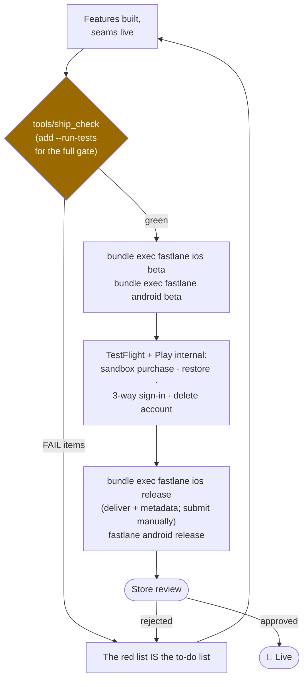

# Release: metadata, lanes, and the gate

*Part of the [Daedalus wiki](README.md) · related: [Pipeline](pipeline.md),
[Backend](backend.md), [Compliance & Web](compliance-and-web.md)*

The release rail runs from the manifest to the store consoles: store copy is
generated (never hand-edited), upload lanes are stamped, and a linter stands
at the submission gate turning "am I ready?" into a red/green list.

## The submission flow

## store_gen: manifest → store copy

`tools/store_gen` (4 tests) maps the manifest `store` block into both trees:

| Output | From | Limit enforced |
|---|---|---|
| `fastlane/metadata/en-US/name.txt` | identity.name | 30 |
| `…/subtitle.txt` | identity.tagline | **30** (caught a real bug in our own example on its first run) |
| `…/keywords.txt` | store.keywords, comma-joined | **100 total** (the classic gotcha) |
| `…/description.txt` | store.full_description | 4000 |
| `…/promotional_text.txt` | store.short_description | 170 |
| `…/support_url` · `marketing_url` · `privacy_url` | studio + legal | — |
| `…/android/en-US/title.txt` | identity.name | 30 |
| `…/android/en-US/short_description.txt` | store.short_description | **80** |
| `…/android/en-US/full_description.txt` + changelog | store.full_description | 4000 |

Limits are **warnings, never truncation** — shortening copy is a product
decision. Store copy changed? Edit the manifest, re-run store_gen. The txt
files are build artifacts.

## Fastlane lanes (stamped with every app)

`fastlane/Appfile` arrives pre-filled with the bundle ids from the manifest;
the `Fastfile` builds with Flutter and uploads with fastlane:

| Lane | Does |
|---|---|
| `ios beta` | `flutter build ipa --release` → TestFlight |
| `ios release` | build → `deliver` with `fastlane/metadata` (submit_for_review stays false until the listing is complete) |
| `android beta` | `flutter build appbundle` → Play **internal** track |
| `android release` | build → Play **production** with supply metadata |

One-time human setup (Phase 4 territory): iOS signing via `fastlane match`
(or Xcode-managed), an App Store Connect API key for CI, the Android upload
keystore, and a Play service-account JSON (gitignored) for supply.

## ship_check: the gate

Run from the app root: `dart run bin/ship_check.dart . [--run-tests]`
(from `tools/ship_check`). Exit 1 on any FAIL; warnings don't block.

| Check | FAILs when | Why it exists |
|---|---|---|
| feature stubs | any generated stub text remains in `lib/features` | Apple 4.3 rejects stub-only apps |
| firebase seam | `useFirebase` still false | release would ship mock auth |
| revenuecat seam | `useRevenueCat` still false | purchases would be mocked |
| firebase options | placeholder `firebase_options.dart` | flutterfire never ran |
| privacy manifest | `PrivacyInfo.xcprivacy` missing (WARN if present but absent from pbxproj) | Apple requires it in the bundle |
| att string | `tracking: true` without `NSUserTrackingUsageDescription` | rejected at upload |
| secrets hygiene | `appl_…`/`goog_…` key literal in lib/ | keys travel via `--dart-define` only |
| legal artifacts | `legal/` not generated | forge step 4 + site registration |
| store metadata | missing, or over hard limits | store console rejections |
| version | pubspec version not `x.y.z+n` | sanity |
| backend | `firestore.rules` absent (WARN) | older stamp |
| flutter test | failures (only with `--run-tests`) | the full gate |

forge.sh runs ship_check as its closing step — **red on day 0 is expected
and is precisely the remaining to-do list.**

> **🔲 TODO (Phase 4):** the lanes have never pushed a real binary — first
> TestFlight/Play-internal runs happen at live validation, which will also
> pin exact fastlane action options against the installed version. See
> [Future systems](future.md#phase-4--live-validation).

> **🔲 TODO (future):** screenshots are manual (`skip_upload_screenshots:
> true`); a screenshot pipeline (device frames from the signature moment) is
> parked — see [Future systems](future.md#parking-lot).
