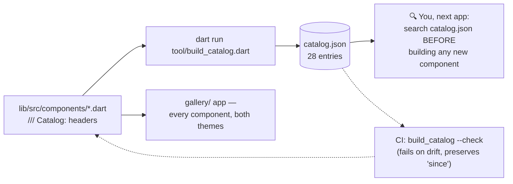
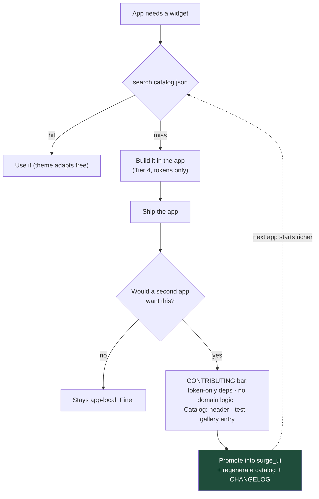

# surge_ui: the toolbox

*Part of the [Daedalus wiki](README.md) · related:
[Architecture](architecture.md), [Foundation](foundation.md) · in-package:
[CATALOG.md](../packages/surge_ui/CATALOG.md),
[CONTRIBUTING.md](../packages/surge_ui/CONTRIBUTING.md)*

Tier 2: the shared component library every Surge app styles itself with.
v0.3.0 · **28 components** · 14 tests · a generated, searchable catalog · a
gallery app for eyeballing. Depends on Flutter alone — tokens in, widgets
out, zero domain logic or state management.

## The token contract

`SurgeTokens` is a frozen `ThemeExtension`: **bg** (base/subtle/inset) ·
**ink** (primary/secondary/tertiary/disabled) · **line** (hairline/strong) ·
**accent** (base/pressed/tint/on) · **status** (success/warning/danger +
tints) · **inverse** · shadows. Apps recolor via the manifest palette;
the *shape* of the contract never changes without a major bump. Domain
colors (Ladle's macro P/C/F) live in per-app extensions.

Companions: `SurgeText` type scale (display 34 → micro 11, `.tnum` for
numerals), `SurgeSpace` (4-pt grid: xs4–xxl32), `SurgeRadii` (sm8 → pill999),
and `buildSurgeTheme(brightness, tokens:, fontFamily:)`. Access is always
`context.tokens` — **a hex literal in a widget is a review-blocking bug.**

## How the catalog stays truthful

Every component carries a structured `/// Catalog:` doc header (name,
category, summary, whenToUse, variants, tags). A generator turns those into
`catalog.json`; CI fails if the two drift.



## Component inventory (by category)

| Category | Components |
|---|---|
| Actions | `SurgeButton` (.primary/.secondary/.destructive/.ghost/.small), `SurgeIconButton`, `SurgeMagicCta`, `SurgePressable` (+`.row`) |
| Inputs | `SurgeTextField`, `SurgeSearchField`, `SurgeToggle`, `SurgeSegmented` (expand/hug), `SurgeStepper` |
| Display | `SurgeText` scale, `SurgeCard` (+`SurgeActionCard`), `SurgeListRow`, `SurgeIconTile`, `SurgeGroupSection`/`SurgeGroupRow`, `SurgeChip` (filter/tag), `SurgeBadge` |
| Feedback | `SurgeBanner`, `SurgeToast` (coalescing), `SurgeSpinner`, `SurgeProgressBar`, `SurgeIndeterminateBar`, `SurgeSkeleton`, `SurgeEmptyState`, `SurgeLoadingLabel`, `SurgePlaceholder` |
| Overlays | `SurgeSheet` / `showSurgeSheet` / `showSurgeConfirm` / `showSurgeActionMenu` |

(Authoritative list: `catalog.json` — this table is a snapshot.)

## The promotion path (how the toolbox grows)

The framework's compounding loop: custom work from one app becomes free for
the next.



> **🔲 TODO:** the promotion path is defined but has not yet been exercised
> by a real app cycle — the first Tier-4 → Tier-2 promotion will stress-test
> the CONTRIBUTING bar. Track in [Future systems](future.md#parking-lot).

## Commands

```bash
cd packages/surge_ui
flutter test                              # 14 tests
dart run tool/build_catalog.dart          # regenerate catalog.json
dart run tool/build_catalog.dart --check  # CI freshness gate
cd gallery && flutter run                 # visual reference
```

> **🔲 TODO (D7):** no golden tests — gallery verification is manual by
> design while visual churn is high. Add goldens when the components settle.
